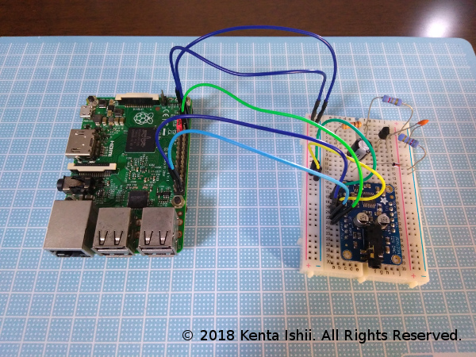

# Synthesizer

* Author: Kenta Ishii
* License: MIT
* License URL: https://opensource.org/licenses/MIT

## Information of this README and comments in this project may be incorrect. This project is not an official document of ARM, Broadcom Ltd., Raspberry Pi Foundation and other holders of any Intellectual Property (IP), and is made of my experience, and even my hypothesis to the architecture of Raspberry Pi. Please don't apply these information in this project to your development. `TEST IT BY YOURSELF AND CONFIRM IT BY AUTHORITY FOR SAFETY` is an important value as a developer.

**Output/Input**

* GPIO12 as Output of PWM0 on sound=pwm

* GPIO13 as Output of PWM1 on sound=pwm

* GPIO40 as Output of PWM0 on sound=jack

* GPIO45 (GPIO41 on RasPi 3B) as Output of PWM1 on sound=jack

* GPIO17 as Output of Synchronization Clock OUT

* GPIO27 as Input of Synchronization Clock IN, Connect with Any Synchronization Clock OUT.

* GPIO22-26 as Input of GPIO for Buttons (Up to 3.3V): CAUTION! DON'T MAKE A SHORT CIRCUIT BETWEEN POWER SOURCE AND GROUND. OTHERWISE YOUR RASPBERRY PI WILL BE BROKEN. CHECK OUT GPIO MAP SO CAREFULLY.

* GPIO 18 (BCLK), 19 (LRCLK), and 21 (DOUT) as Output of I2S (as known as 3-wire I2S) on sound=i2s

* HDMI as VIDEO Output (For Debug Only)

* To Test Input, Use [GPIO Push Button](https://github.com/JimmyKenMerchant/Python_Codes).

## GPIO 22-27 ARE UP TO VOLTAGE OF 3.3V TO INPUT!!! DON'T INPUT VOLTAGE OVER 3.3V TO GPIO PIN!!! OTHERWISE, YOU WILL BE IN DANGER!!! IF YOU CAN'T UNDERSTAND ABOUT THIS, PLEASE STUDY ELECTRONICS FOR A WHILE BEFORE DOING THIS.

**About PCM Output**

* This sampling rate has jitter. Your DAC is needed its jitter remover.

* SCLK (System Clock) / MCLK (Master Clock) is not supported because the modern IC on your DAC generates the clock by itself.

* I'm using UDA1334A, one of I2S Stereo DAC. As of July 2018, you can purchase online a module which UDA1334A is boarded on.

**Compatibility**

* Raspberry Pi Zero W V.1.1 (BCM2835), `make type=zerow sound=i2s` or `make type=zerow sound=pwm`

* Raspberry Pi 2 B V.1.1 (BCM2836), `make type=2b sound=i2s` or `make type=2b sound=pwm` or `make type=2b sound=jack`

* Raspberry Pi 3 B V.1.2 (BCM2837), `make type=3b sound=i2s` or `make type=3b sound=pwm` or `make type=3b sound=jack`

* I recommend you to use `sound=i2s` because of its good sound.

## Make sure to build your own RC Low-pass Filter for PWM0/1 from GPIO Pins.

## Sound outputs generate unpredictable voltage or current. This affects the digital circuit of your Raspberry Pi as resonance, surge, etc. Basically, separation between a digital circuit (in this case, Raspberry Pi) and a analogue circuit (Low-pass Filter, Amplifier, Speaker, etc.) is common sense among hardware developers, otherwise, break or malfunction occurs on your Raspberry Pi.

**Caution on Sound Output**

* You'll meet big sound. Please care of your ears. I recommend that you don't use any earphone for this project.

* Speaker and other sound outputs are so easy to break if you supply Direct Current to these. Sound outputs are made with considering of supplying Alternating Current. If you apply any sound outputs to GPIO pins directly, it causes to break these your materials.

* Typically, sound outputs made of coils. The coil generate electric surge that breaks your Raspberry Pi. To hide this, there are some solutions. Please search.

* If you want to check the wave by your oscilloscope, a decoupling capacitor is needed. In my experience, a 1-microfarad-capacitor without any attenuator makes the figure of the wave. Besides, if you don't apply any capacitor, pulses of PWM will be directly caught by your oscilloscope and it will breaks the figure of the wave.

* Sound outputs change your RasPi's electrical status. The big problem is the change of the voltage of ground (by means of chassis). This may make black-out/brown-out of your RasPi. If possible and having your skills, you can apply earth wire with the chassis of your RasPi.
